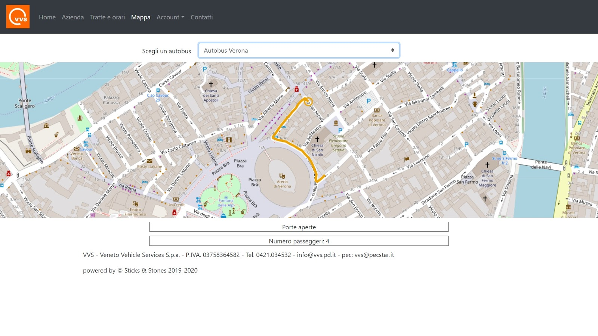

# SticksandStones Repo for Project Work
[Dashboard on Trello](https://trello.com/b/1Z6gDGxO/dam-ss)

Here there are all files of this project

## Getting Started
S&S is our new Startup created to analyze and improve the company's managment and keeping customer's benefit optimal.
These instructions will get you a copy of the project up and running on your local machine for development and testing purposes. See deployment for notes on how to deploy the project on a live system.

### Prerequisites

- A browser
- ~~An Internet connection~~
- NodeJS, Redis, InfluxDB & Postgres
- .NET for running .cs files

To download the needed software follow these links from official sites:
- [NodeJS (v10.15.3)](https://nodejs.org/en/download/)
- [Redis (v5.0)](https://redis.io/download)
- [InfluxDB (v1.7.9)](https://portal.influxdata.com/downloads/)
- [Postgres (v12)](https://www.postgresql.org/download/)
- [.NET (v4.7.2)](https://dotnet.microsoft.com/download/dotnet-framework)

We don't guarantee that works with newer version that specified before. You can also download and run these applications on Docker containers.

### Installing


Download this repository and install node_modules

```
git clone https://github.com/jakosaba98/SticksandStones/
npm install
```

Run the server

```
cd node-server
npm start
```

Run simulation of movements

```
C:\Windows\Microsoft.NET\Framework\v4.0.30319\csc.exe .\readersender\DataReader\Program.cs &
C:\Windows\Microsoft.NET\Framework\v4.0.30319\csc.exe .\readersender\DataSender\Program.cs
```

Go to http://localhost, do login and move on maps page. Then choose your bus to know his real-time position.



## Running the tests

We will develop an automated system for running tests

It's important to test API calls and correct insert of data

Test a connection to DB (a correct response returns code 204)
```
curl http://localhost/ping
```

## Deployment

We will write a guide and publish the files needed and where to save them

## Built With

* ~~[AWS](https://aws.amazon.com) Amazon EC2, Load Balancer - Server where we store data and website~~
* [Visual Studio Code](https://code.visualstudio.com/) - Framework used to write HTML, CSS, Javascript code
* [Visual Studio 2019](https://visualstudio.microsoft.com/downloads/) - Framework used to write C# code for GPS simulators


## Contributing


## Versioning

We use [SemVer](http://semver.org/) for versioning. For the versions available, see the [tags on this repository](https://github.com/jakosaba98/SticksandStones/tags). 

## Authors

* **Lorenzo Tomasello** - *Server Manager* - [SticksandStones](https://github.com/ENSOO)
* **Giacomo Saba** - *C#* - [SticksandStones](https://github.com/jakosaba98)
* **Gianluca Pistoia** - *InfluxDB, HTML & Style* - [SticksandStones](https://github.com/gianlucapistoia)
* **Pietro Wendler** - *Github & Trello Manager* - [SticksandStones](https://github.com/PietroWendler)


## License

This project is licensed under the MIT License - see the [LICENSE.md](https://en.wikipedia.org/wiki/MIT_License) for details

## Important Notes

We planned to run our server online using AWS services, but our volume was cancelled one week before we planned stable version release. We changed all configurations to make it work properly in time, so we decided to cancel deployment of a public online server and a future develop of a dedicated application for Android devices.